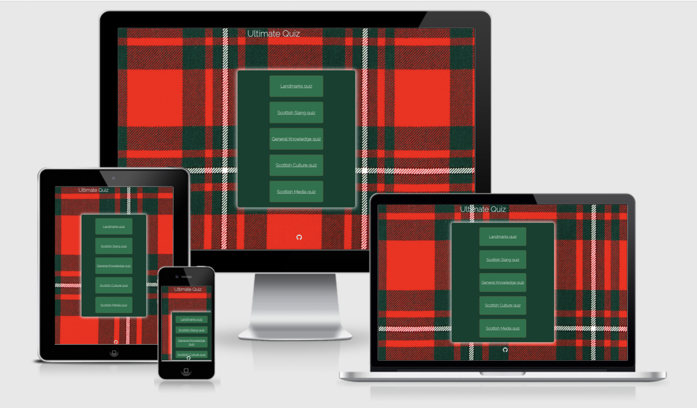
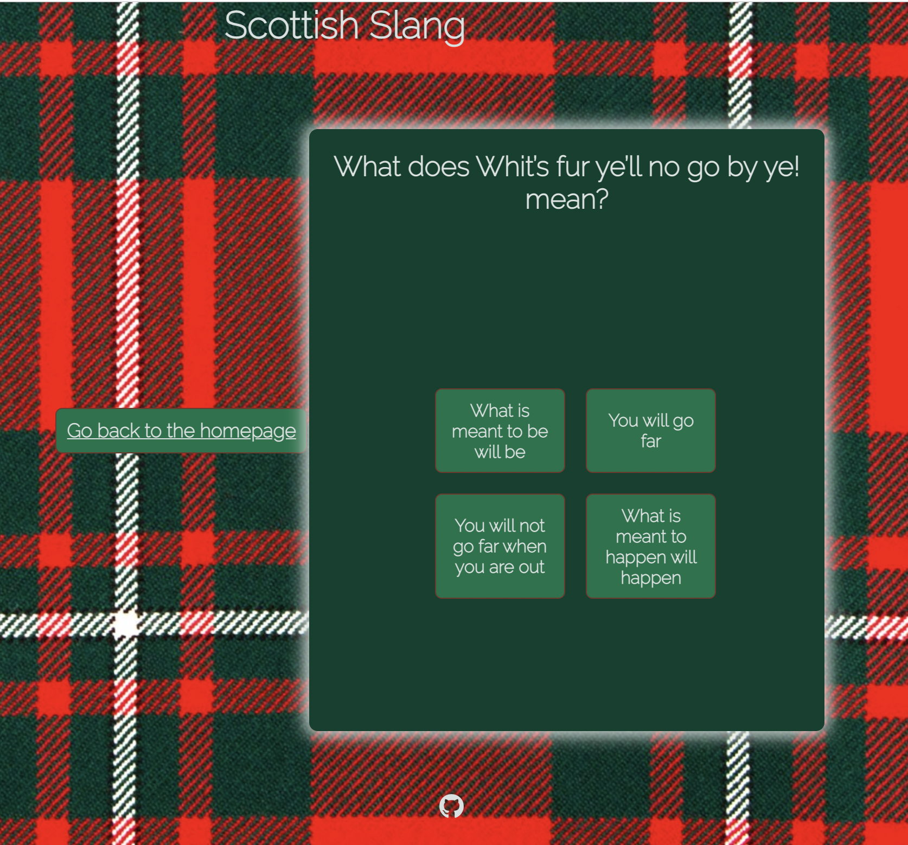
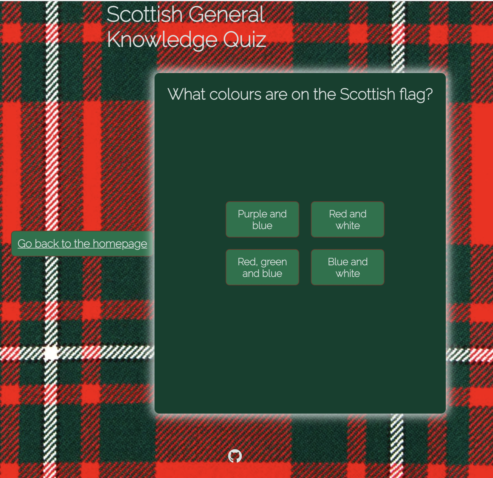
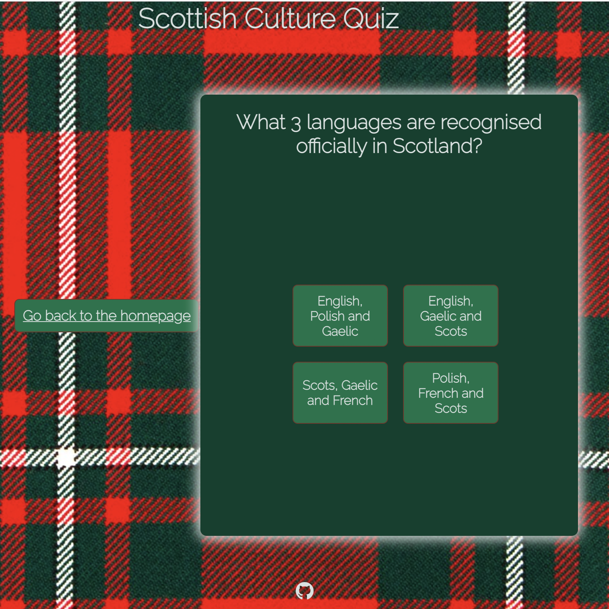
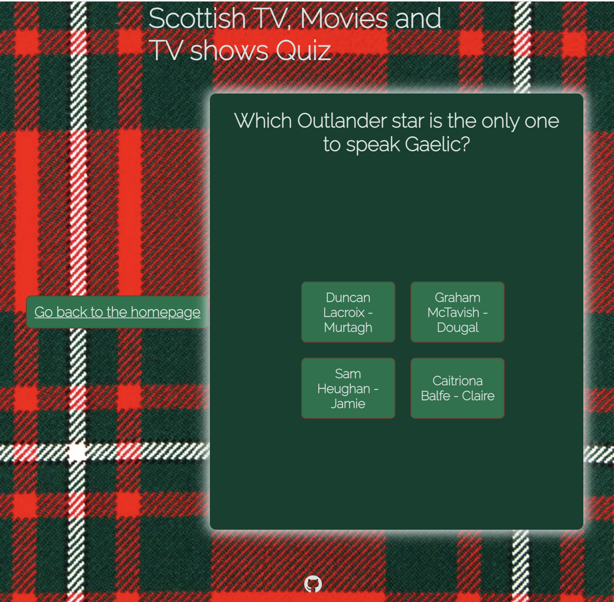

# Scottish Quiz Game

## Introduction

The Scottish Quiz game is a fun way for people to test their knowledge on fun Scottish trivia. The site is targeted at users who have an interest in unique parts of Scottish culture. This quiz suits this demographic as it has different sections based on culture, slang, media and a little bit of general knowledge too.

## Planning Stages

### Site Aims

- To create a fun game for people to test their knowledge on Scottish trivia.
- The questions and answers to be in a grid that resembles a playing card. I tried to achieve this by creating a grid that was a similar shape and size to one.
  
### Technologies Used

- HTML for the main structure of the website
- CSS to create the design aspects of the quiz
- JavaScript for the interactivity of the quiz and for the improved user experience of the quiz.

## Screenshots

## Testing

### Manual Testing

During the build of the repository, I manually checked the website throughout on my large desktop computer, laptop and mobile phone to make sure the look and feel of the website was correct. I also used Chrome Dev Tools to see how the website would look on different sizes also.

During the build, I found one major bug in the project. 

- **Bug** The images on the [landmark JS file](assets/js/landmarks.js) were not loading correctly.
- **Test** During testing of this issue, I found that it was because of the image filepath. The **img src** path was the problem.
- **Result** To solve this, I changed the filepath to **img:**.

#### Unfixed Bugs

The images filepath, although changed to a relative path, still doesn't populate correctly on mobile devices. I have tested this via Google Incognito mode and the images populate correctly.

### Post Deployment Testing

After developing the website, I used validation tools to highlight any performance issues. 

I tested the performance using [JsHint](https://jshint.com/), [W3 HTML Validator](https://validator.w3.org/nu/) and [Jigsaw CSS Validator](https://jigsaw.w3.org/css-validator/) and found no major issues.

The only small error was via [W3 HTML Validator](https://validator.w3.org/nu) whereby, the tool verified that having the links on the [Index Page](index.html) as buttons should not be nested within an a element. I then changed the buttons to a class tags and this solved the issue.

## Deployment

1. From the project's repository, go to the **Settings** tab
2. From the menu on the left-hand side, select the **Pages** tab
3. In the **Source** section, select the option for **Main** branch in the drop down menu and click **Save**
4. A message will be displayed to advise the project owner of a successful deployment to GitHub pages and the live link will be provided also

The live site via the following URL - [Scottish Quiz](https://justkirst.github.io/scottish-quiz/)

## Credits

* All content on the website was written by myself
* Fonts were sourced from [Google Fonts](https://fonts.google.com/)
* Icons were sourced from [Font Awesome](https://fontawesome.com/icons)
* The photos used were sourced from [Google Images](https://images.google.com/)

I also want to thank my menotr Richard for his support and advice during this projcet.

## References

I used [Coding Ninjas tutoria](https://www.codingninjas.com/blog/2021/08/02/how-to-create-a-quiz-app-using-javascript/) for reference on how to create a JavaScript quiz.